# README Generator

***

## Description
This program is designed to take in user input via the Command Line Interface (CLI) in order to generate a properly formatted "README" file.

[Click here to see a video tutorial](https://youtu.be/C3lQWJFi8cg)

***

## Setup
Since it is accessed via the CLI, the files must first be downloaded onto your computer.

**Note**: This program requires Node.js to run. Downlaod Node.js from [This Website](https://nodejs.org/en/) if you haven't already.

Once Node.js is installed and the files for this program have been downloaded, navigate to the main parent directory via the CLI.

This program uses the Inquirer Node Module, so before you can start using the Generator, you'll need to run the following line in your CLI:

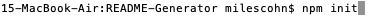
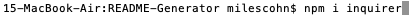

You should then have a folder with the following contents:
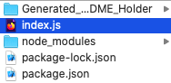

You are now free to use the README Generator!

***

## How to Use
Start by navigating to the program's Parent Directory via the CLI.

Once there, run the following line of code to start the program;
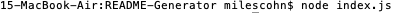

**First** enter the name of the program the README is for.

**Second** enter a description of the program.
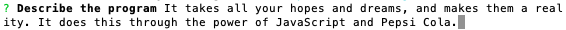

**Third** explain how to install your program.
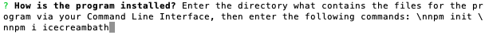

**Fourth** explain how to use this program.
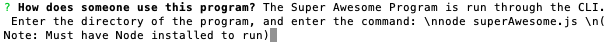

**Fifth** select with type of license the program has, from the list provided.
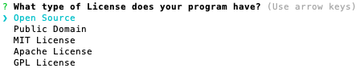

**Sixth** list any areas or features of the app that are still in buggy, or are otherwise in development.
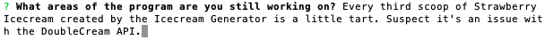

**Seventh** explain how someone could contribute to this app is they so choose.
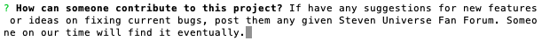

**Eighth** enter yout contact information: your GitHub username, followed by your email address.
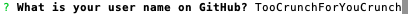

**Finally** after all the above steps have been followed, you should see the following message:
[File Generated](./Screenshots/13success.png)

**Congratulations**!!! You have successfully generated a README.md file! It will be stored in the folder/directory named "Generated_README_Holder"

The README.md file will look something like this:

***

# The Super Awesome Program

## Table of Contents 
- [Description](#description) 
- [Installation](#installation) 
- [Usage](#usage) 
- [License](#license) 
- [Tests](#tests) 
- [Contributions](#contributions) 
- [Questions](#questions)

## Description 
It takes all your hopes and dreams, and makes them a reality. It does this through the power of JavaScript and Pepsi Cola.

## Installation 
Enter the directory what contains the files for the program via your Command Line Interface, then enter the following commands: 
npm init 
npm i icecreambath

## Usage 
The Super Awesome Program is run through the CLI. Enter the directory of the program, and enter the command: 
node superAwesome.js 
(Note: Must have Node installed to run)

## License 
Open Source

## Tests 
Every third scoop of Strawberry Icecream created by the Icecream Generator is a little tart. Suspect it's an issue with the DoubleCream API.

## Contributions 
If have any suggestions for new features or ideas on fixing current bugs, post them any given Steven Universe Fan Forum. Someone on our time will find it eventually.

## Questions 
If you have any questions, you can contact me [Through GitHub](https://github.com/TooCrunchForYouCrunch)
## Or through my email: ohgodwhathasbecomeofbylife42@gmail.com